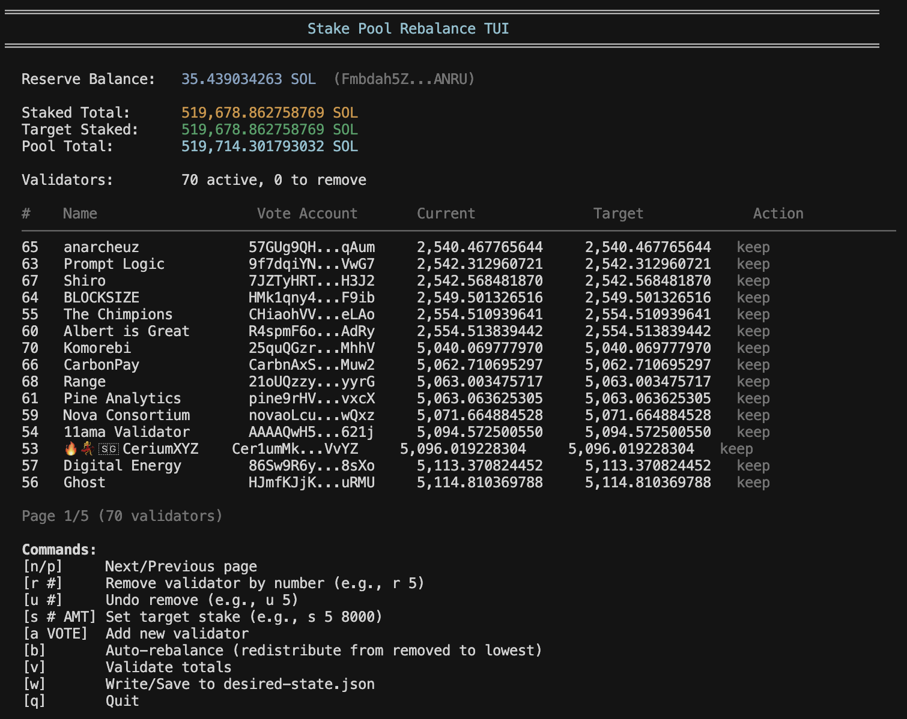

# Multi-Validator Stake Pool Rebalancer TUI

Built for **stake pool operators** who need to rebalance validator allocations across multiple pools. Manually calculating stake distributions, tracking validator changes, and generating execution commands is error-prone and time-consuming. This tool solves that by providing an interactive interface to plan rebalancing operations, validate totals, and automatically generate ready-to-run execution scripts—all while ensuring your pool's stake totals remain balanced.



## Features

- 📊 **Live Data**: Fetches current pool state directly from the Solana blockchain
- 🎨 **Interactive TUI**: Visual interface showing validators, balances, and reserve
- ⚖️ **Auto-Rebalance**: Redistribute stake from removed validators automatically
- ✅ **Validation**: Ensures totals balance before generating scripts
- 🔧 **Script Generation**: Creates ready-to-run bash scripts for execution
- 🌐 **Pool Agnostic**: Works with any Solana stake pool

## Quick Start

```bash
# Install dependencies
bun install

cp .env.example .env

# Set your pool address in the .env file
POOL_ADDRESS=your_pool_address_here
RPC_URL=your_rpc_url_here

# Run the rebalancer
bun run rebalance
```

## Usage

The TUI provides an interactive interface with the following commands:

- `r #` - Remove validator by number
- `u #` - Undo remove
- `s # AMT` - Set target stake amount
- `a VOTE` - Add new validator
- `b` - Auto-rebalance (redistribute from removed validators)
- `v` - Validate totals
- `w` - Write/Save desired state and generate scripts
- `q` - Quit

## Output

After saving (`w`), the tool generates:

- `desired-state.json` - Complete rebalancing plan
- `rebalance_YYYY-MM-DD/` - Folder containing execution scripts:
  - `01_decrease_and_remove.sh` - Remove validators
  - `02_increase_stake.sh` - Increase stake to validators

## Requirements

- [Bun](https://bun.sh) runtime
- `POOL_ADDRESS` environment variable (required)
- `RPC_URL` environment variable (optional, defaults to mainnet-beta)

---

**Built by the team at [Brew Labs](https://www.brewlabs.so/)**

Developing open source infrastructure tools and solutions for the Solana ecosystem.

